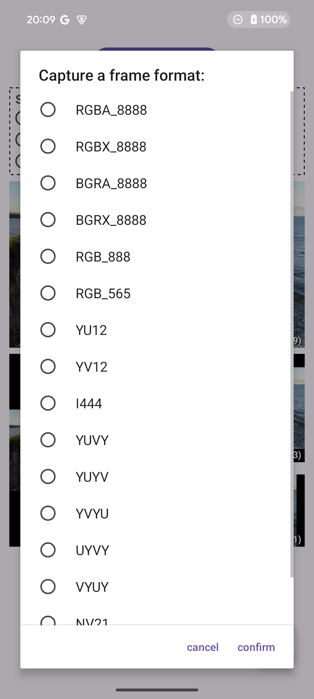

# SurfaceBridge
---
SurfaceBridge是一个用于将Surface图像数据快速提取出来的工具类，Surface数据源可以来自MediaCodec、Camera、VirtualDisplay等。
SurfaceBridge支持多种输出格式，比如RGB、YUV420、YUV444等等。当然，你也可以直接把SurfaceView、TextureView作为输出源。同时为了兼容各种不同的输出大小和比例，SurfaceBridge支持传入一个Matrix参数去控制图像的变换。


## 支持输出格式
---
### 帧格式
* RGBA
  * RGBA_8888, RGBX_8888, RGB_888, RGB_565
* BGRA
  * BGRA_8888, BGRX_8888
* YUV_420
  * NV12, NV21, YU12, YV12
* YUV_422
    * YUVY, YUYV, YVYU, UYVY, VYUY
* YUV_444
    * I444

### 颜色空间
* BT.601
* BT.709
* BT.2020

## 示例工程
---
可以通过运行demo（App module）去学习SurfaceBridge的用法，demo展示了如何渲染来自不同数据源的数据，并且通过设置不同的ScaleType去变换图像。同时也展示了如何去获取不同的原始帧格式。




## 引入依赖
---
### Gradle
```Gradle
repositories {
  ......
  mavenCentral()
}

dependencies {
  implementation 'io.zxingye.library:surfacebridge:1.0.0'
}
```

### Maven
```xml
<dependency>
  <groupId>io.zxingye.library</groupId>
  <artifactId>surfacebridge</artifactId>
  <version>1.0.0</version>
</dependency>
```

## 使用
---
